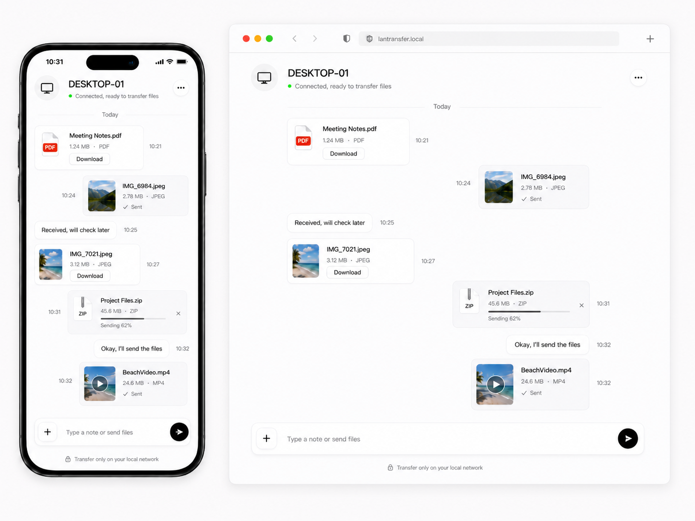

# LanTransfer

[中文文档](./README.zh-CN.md)

LanTransfer is a cross-platform LAN file transfer tool powered by .NET and a browser-based UI. Run the `lantransfer` console host on one device, open the shown LAN URL from another phone, tablet, or computer on the same local network, then upload and download files through a clean transfer page.

## Features

- Browser-based LAN file upload and download
- Cross-platform console host named `lantransfer`
- ASP.NET Core Kestrel receiver using HTTP by default for LAN access
- Static HTML/CSS/JavaScript UI with no frontend build system
- Chat-style file transfer interface for phones, tablets, and desktops
- Streaming file saves with temporary `.uploading` files
- Safe file-name handling, path traversal protection, and readable duplicate names
- Configurable port, storage directory, upload size limit, and optional access token
- Lightweight English and Simplified Chinese web UI localization

## Screenshot



## Platform Support

Receiver:

- Windows, macOS, or Linux with .NET 10

Sender:

- Any modern browser on Windows, macOS, Linux, Android, or iOS

Network:

- Devices must be on the same local network unless you configure VPN, tunneling, or routing yourself.

## Quick Start

```bash
dotnet run --project src/LanTransfer.Host
```

LanTransfer listens on `http://0.0.0.0:8765` and prints local and LAN URLs at startup.

Open one of these URLs:

- Same device: `http://localhost:8765`
- Another device on the LAN: `http://<receiver-ip>:8765`

The first version intentionally uses HTTP on the local network. It does not require trusting an ASP.NET Core development HTTPS certificate.

## Configuration

LanTransfer reads the `LanTransfer` section from `src/LanTransfer.Host/appsettings.json`.

```json
{
  "LanTransfer": {
    "Port": 8765,
    "StorageDirectory": "uploads",
    "MaxFileSizeBytes": 1073741824,
    "AccessToken": null
  }
}
```

If `AccessToken` is configured, protected API calls must include `X-LanTransfer-Token` or `?token=...`.

Environment variables can override configuration values by using the `LanTransfer__` prefix, for example:

```bash
LanTransfer__Port=9000 dotnet run --project src/LanTransfer.Host
```

On PowerShell:

```powershell
$env:LanTransfer__Port = "9000"
dotnet run --project src/LanTransfer.Host
```

## API Overview

- `GET /api/health` returns service status and device name.
- `POST /api/files/upload` uploads one multipart file field named `file`.
- `GET /api/files` lists received files.
- `GET /api/files/{fileName}` downloads a received file.

Error responses use stable `errorCode` values such as `file_too_large`, `file_not_found`, `invalid_file_name`, `unauthorized`, `upload_failed`, and `network_error`.

## Build from Source

```bash
dotnet build LanTransfer.sln
dotnet test LanTransfer.sln
```

Run the built executable directly:

```bash
src/LanTransfer.Host/bin/Debug/net10.0/lantransfer
```

On Windows:

```powershell
.\src\LanTransfer.Host\bin\Debug\net10.0\lantransfer.exe
```

## Release

GitHub Actions automatically creates a GitHub Release when a version tag is pushed:

```bash
git tag v1.0.0
git push origin v1.0.0
```

The release workflow runs tests, publishes self-contained builds, and uploads assets for Windows x64, Linux x64/ARM64, and macOS x64/ARM64.

## Project Structure

```text
LanTransfer/
├─ src/
│  ├─ LanTransfer.Core/
│  └─ LanTransfer.Host/
│     └─ wwwroot/
├─ tests/
│  └─ LanTransfer.Tests/
├─ docs/
├─ screenshots/
├─ README.md
├─ README.zh-CN.md
└─ LanTransfer.sln
```

## Roadmap

- Pairing code flow
- QR code for opening the LAN URL
- Delete and rename actions for received files
- Better image/file thumbnails
- Desktop tray app and notifications
- Stronger authentication for non-trusted networks

## License

MIT
